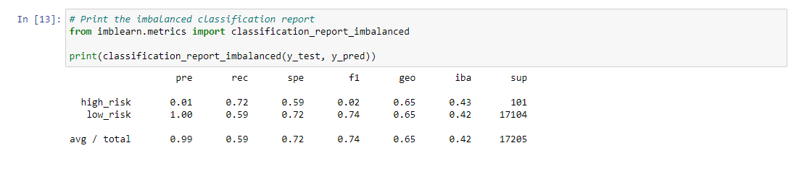
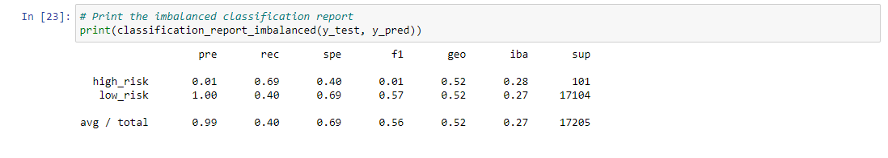
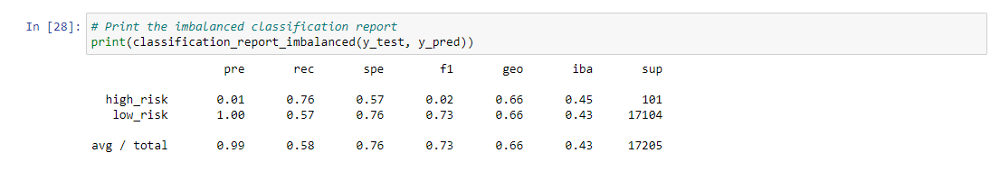
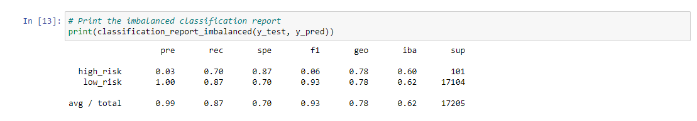
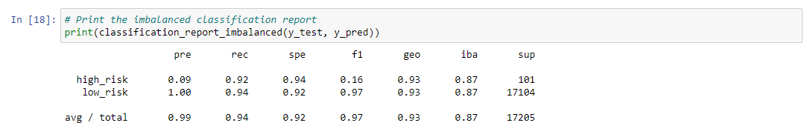

# Credit_Risk_Analysis  

## Overview Of Analysis 

### Background  
Jill is very appreciative for all of the hard work recently. Piece by piece, I have been building and improving my skills in data preparation, statistical reasoning, and machine learning. I am now ready to apply machine learning to solve a real-world challenge: credit card risk.  
Credit risk is an inherently unbalanced classification problem, as good loans easily outnumber risky loans. Therefore, I will need to employ different techniques to train and evaluate models with unbalanced classes. Jill has asked to use imbalanced-learn and scikit-learn libraries to build and evaluate models using resampling.  
I am going to look at Balanced Accuracy Score, Precision Score, and Recall Score.  Balanced Accuracy score is a representation of the overall performace of the model.  Precision Score ( also known as positive predictive value (PPV)) is obtained by dividing the number of true positives (TP) by the number of all positives - Precision = TP/(TP + FP).  Precision Score represents the "likelyhood".  The Sensitivity Score is calculate by the following forumula: Sensitivity = TP/(TP + FN).  It measures "correctly" predicted.  
Using the credit card credit dataset from LendingClub, a peer-to-peer lending services company, I will oversample the data using the RandomOverSampler and SMOTE algorithms, and undersample the data using the ClusterCentroids algorithm. Then, I will use a combinatorial approach of over- and undersampling using the SMOTEENN algorithm. Next, I will compare two new machine learning models that reduce bias, BalancedRandomForestClassifier and EasyEnsembleClassifier, to predict credit risk. Once I am  done, I will evaluate the performance of these models and make a written recommendation on whether they should be used to predict credit risk.  
### What Has Been Created  
This new assignment consists of three technical analysis deliverables and a written report. The following has been submitted:  
* Used Resampling Models to Predict Credit Risk 
* Used the SMOTEENN Algorithm to Predict Credit Risk 
* Used Ensemble Classifiers to Predict Credit Risk  

## Results  
**RandomOverSampler** 
* Balanced Accuracy Score: 0.66 
* Precision Score 
      * High Risk Score: 0.01 
      * Low Risk Score: 1.00 
      * Overall Average/Total Score: 0.99 
* Recall Score 
      * High Risk Score: 0.72 
      * Low Risk Score: 0.59 
      * Overall Average/Total Score: 0.59 
  

**SMOTE** 
* Balanced Accuracy Score: 0.65 
* Precision Score 
      * High Risk Score: 0.01 
      * Low Risk Score: 1.00 
      * Overall Average/Total Score: 0.99 
* Recall Score 
      * High Risk Score: 0.60 
      * Low Risk Score: 0.69 
      * Overall Average/Total Score: 0.69 
  

**ClusterCentroids** 
* Balanced Accuracy Score: 0.65 
* Precision Score 
      * High Risk Score: 0.01 
      * Low Risk Score: 1.00 
      * Overall Average/Total Score: 0.99 
* Recall Score 
      * High Risk Score: 0.69 
      * Low Risk Score: 0.40 
      * Overall Average/Total Score: 0.40 
  

**SMOTEENN** 
* Balanced Accuracy Score: 0.54 
* Precision Score 
      * High Risk Score: 0.01 
      * Low Risk Score: 1.00 
      * Overall Average/Total Score: 0.99 
* Recall Score 
      * High Risk Score: 0.76 
      * Low Risk Score: 0.57 
      * Overall Average/Total Score: 0.58 
  

**BalancedRandomForestClassifier** 
* Balanced Accuracy Score: 0.79 
* Precision Score 
      * High Risk Score: 0.03 
      * Low Risk Score: 1.00 
      * Overall Average/Total Score: 0.99 
* Recall Score 
      * High Risk Score: 0.70 
      * Low Risk Score: 0.87 
      * Overall Average/Total Score: 0.87 
  

**EasyEnsembleClassifier** 
* Balanced Accuracy Score: 0.93 
* Precision Score 
      * High Risk Score: 0.09 
      * Low Risk Score: 1.00 
      * Overall Average/Total Score: 0.99 
* Recall Score 
      * High Risk Score: 0.92 
      * Low Risk Score: 0.94 
      * Overall Average/Total Score: 0.94 
  

## Summary  

Reviewing the data outputs, the two models that stand out in their performance are the BalancedRandomForestClassifier and EasyEnsembleClassifier - with EasyEnsembleClassifier being the heavyweight of all models. 

The F1 score, also called the harmonic mean, can be characterized as a single summary statistic of precision and sensitivity.  The F1 score can be used to assess a model's performance and reviewing the two models we see that the BalancedRandomForestClassifier scored an overall average/total score of 0.93 and the EasyEnsembleClassifier scored an overall average/total score of 0.97. 

As always, I appreciate the trust and patience as I worked through this project. If further information, analysis, or discussion is needed - please do not hestitate to reach out to me.  
