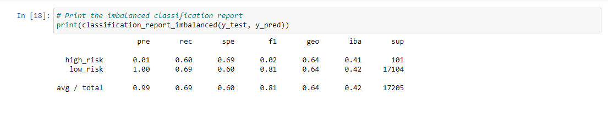

# Credit_Risk_Analysis  

## Overview Of Analysis 

### Background  
Jill commends you for all your hard work. Piece by piece, you have been building up your skills in data preparation, statistical reasoning, and machine learning. You are now ready to apply machine learning to solve a real-world challenge: credit card risk.  
Credit risk is an inherently unbalanced classification problem, as good loans easily outnumber risky loans. Therefore, you will need to employ different techniques to train and evaluate models with unbalanced classes. Jill asks you to use imbalanced-learn and scikit-learn libraries to build and evaluate models using resampling.  
Using the credit card credit dataset from LendingClub, a peer-to-peer lending services company, you will oversample the data using the RandomOverSampler and SMOTE algorithms, and undersample the data using the ClusterCentroids algorithm. Then, you will use a combinatorial approach of over- and undersampling using the SMOTEENN algorithm. Next, you will compare two new machine learning models that reduce bias, BalancedRandomForestClassifier and EasyEnsembleClassifier, to predict credit risk. Once you are done, you will evaluate the performance of these models and make a written recommendation on whether they should be used to predict credit risk.  
### What Has Been Created  
This new assignment consists of three technical analysis deliverables and a written report. The following has been submitted:  
* Used Resampling Models to Predict Credit Risk 
* Used the SMOTEENN Algorithm to Predict Credit Risk 
* Used Ensemble Classifiers to Predict Credit Risk  

## Results  
**RandomOverSampler** 
* Balanced Accuracy Score: 0.66 
* Precision Score 
      * High Risk Score: 0.01 
      * Low Risk Score: 1.00 
      * Overall Average/Total Score: 0.99 
* Recall Score 
      * High Risk Score: 0.72 
      * Low Risk Score: 0.59 
      * Overall Average/Total Score: 0.59 
  

**SMOTE** 
* Balanced Accuracy Score: 0.65 
* Precision Score 
      * High Risk Score: 0.01 
      * Low Risk Score: 1.00 
      * Overall Average/Total Score: 0.99 
* Recall Score 
      * High Risk Score: 0.60 
      * Low Risk Score: 0.69 
      * Overall Average/Total Score: 0.69 
  

**ClusterCentroids** 
* Balanced Accuracy Score: 0.65 
* Precision Score 
      * High Risk Score: 0.01 
      * Low Risk Score: 1.00 
      * Overall Average/Total Score: 0.99 
* Recall Score 
      * High Risk Score: 0.69 
      * Low Risk Score: 0.40 
      * Overall Average/Total Score: 0.40 
  

**SMOTEENN** 
* Balanced Accuracy Score: 0.54 
* Precision Score 
      * High Risk Score: 0.01 
      * Low Risk Score: 1.00 
      * Overall Average/Total Score: 0.99 
* Recall Score 
      * High Risk Score: 0.76 
      * Low Risk Score: 0.57 
      * Overall Average/Total Score: 0.58 
  

**BalancedRandomForestClassifier** 
* Balanced Accuracy Score: 0.79 
* Precision Score 
      * High Risk Score: 0.03 
      * Low Risk Score: 1.00 
      * Overall Average/Total Score: 0.99 
* Recall Score 
      * High Risk Score: 0.70 
      * Low Risk Score: 0.87 
      * Overall Average/Total Score: 0.87 
  

**EasyEnsembleClassifier** 
* Balanced Accuracy Score: 0.93 
* Precision Score 
      * High Risk Score: 0.09 
      * Low Risk Score: 1.00 
      * Overall Average/Total Score: 0.99 
* Recall Score 
      * High Risk Score: 0.92 
      * Low Risk Score: 0.94 
      * Overall Average/Total Score: 0.94 
  

## Summary  
